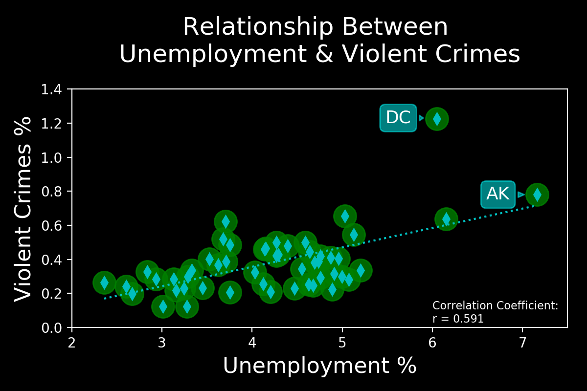
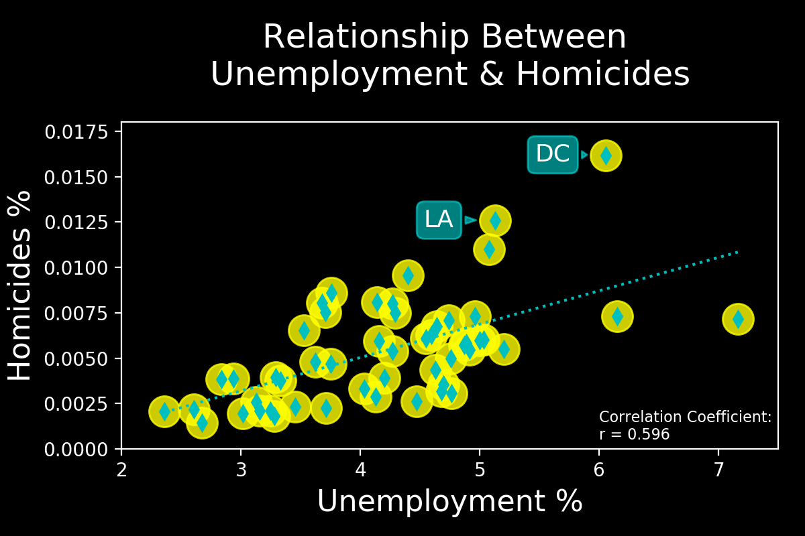
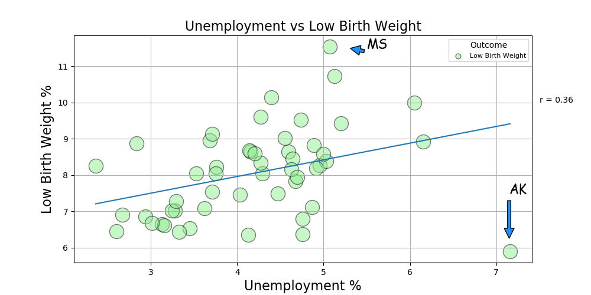

# PROJECT1_Unemployment-Status-and-Health-Outcomes

## Project Focus & Questions with Major Findings:

### Our project will focus on whether or not unemployment status negatively affects health outcomes. Also, by using a 2019 nationwide dataset, we will attempt to show if these negative effects vary by state. 

This project was done by ASpirou, RChounoune, JWang and WEscobar. 
The inital data cleaning was done via group work and can be found within the folder named "GroupWork_DataCleaning." 
The following questions were done individually, with each analysis saved within the appropriate author's folder.

Data source: http://www.countyhealthrankings.org

### Question 1: Do states with higher unemployment rates also have higher crime rates? (answered by ASpirou)

### Question 2: What would be the correlation between a lower unemployment rate and health outcomes vs higher unemployment rate? (answered by RChounoune & JWang)

### Question 3: How do unemployment rates affect access to insurance? (answered by WEscobar)

## Major Findings:

### Question 1:

#### ASpirou - There is a moderately strong positive linear correlation between percentage of unemployed individuals and percentage of violent crimes committed per state (r = 0.591). Furthermore, within violent crimes, the percentage of homicide rates is more positively correlated with rates of unemployment (r = 0.596), whereas deaths by other types of injuries and firearm fatalities have weaker relationships with unemployment (r = 0.278, r = 0.380). 

### Question 2:

#### Chounoune - Southern Arizona, California and Montana have the counties with the highest unemployment rates of over 12%. With a correlation coefficient of r =  0.30, there is evidence of a low positive relationship between unemployment rate and respectively premature deaths and low birth weight.

#### JWang - Unemployment vs Diabetes and HIV prevalence.  From the plots we can conclude that, an increase in unemployment rate doesn't result in higher Diabetes and HIV rates by looking at the two variables by states. The only two states show strong correlations are Alaska, where it has the highest unemployment and Diabetes rate and DC, where it has the second highest unemployment and HIV rate. The regression results support our conclusion as one gives r =0.13 and the other gives r= 0.38 which indicate both variables have low correlation with unemployment rate.

### Question 3:
#### WEscobar - 